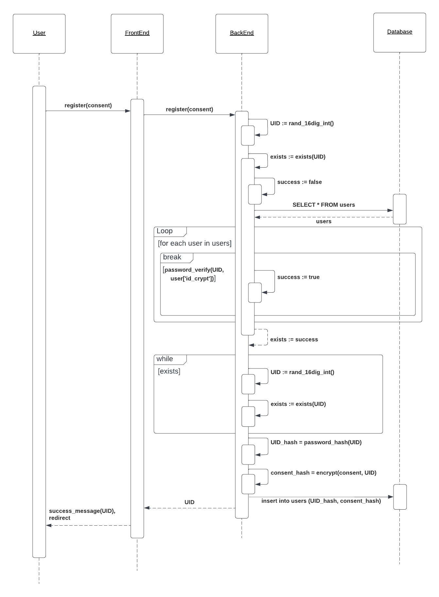
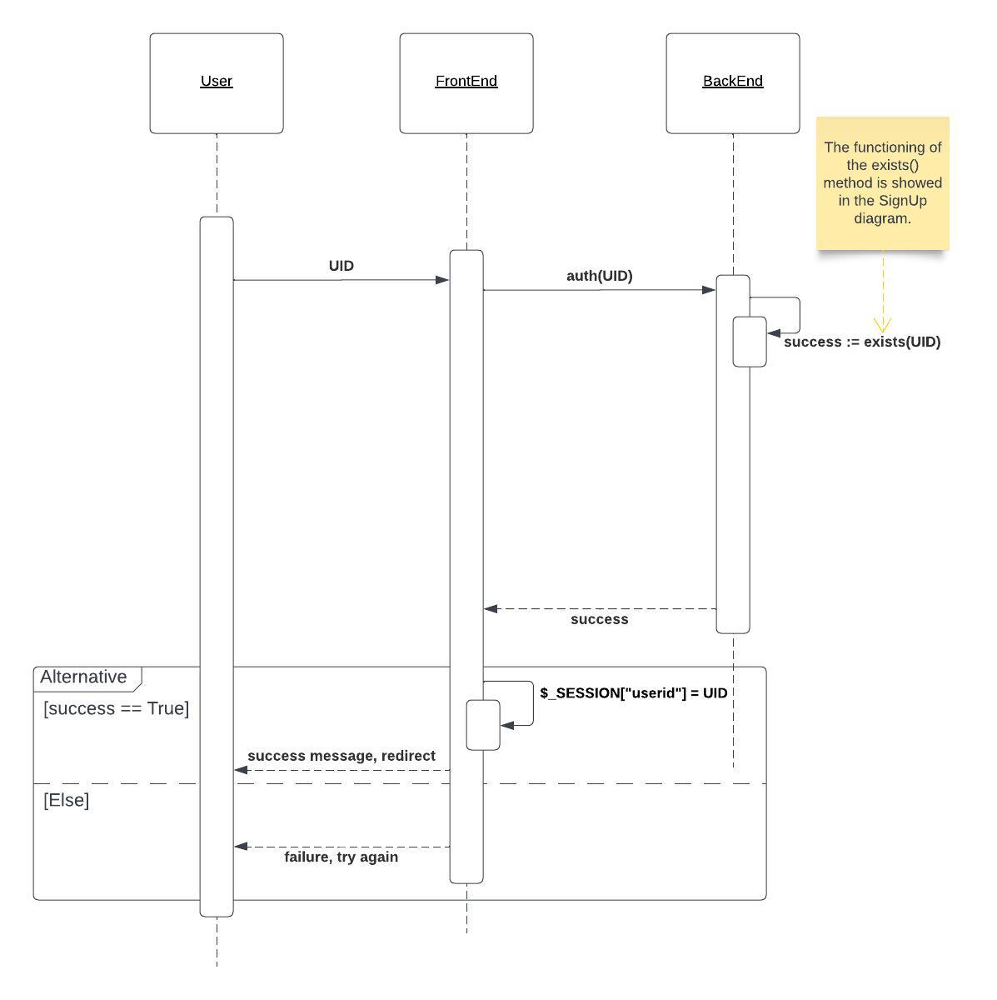
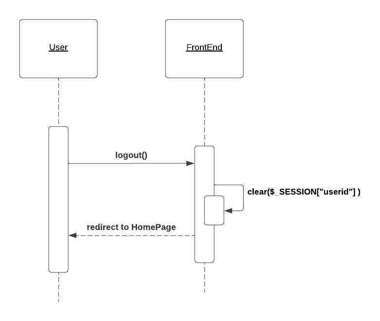
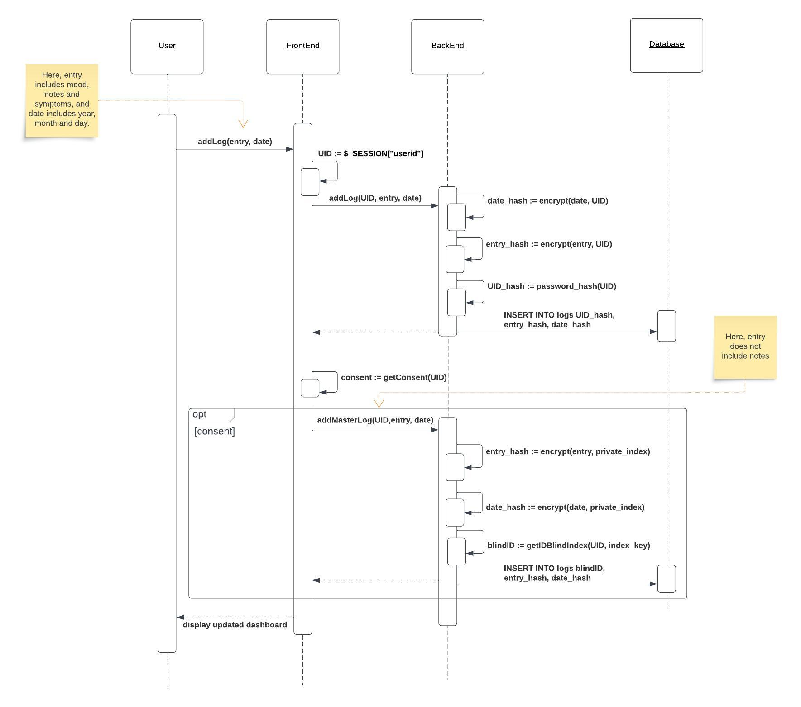
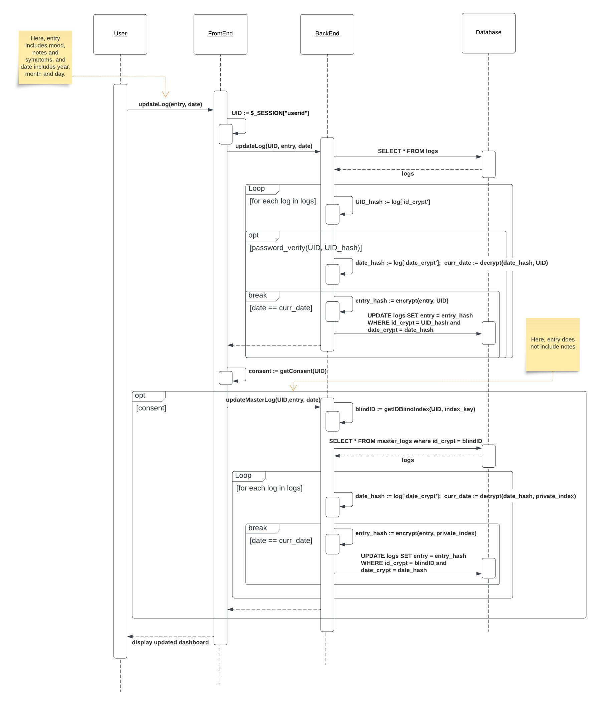
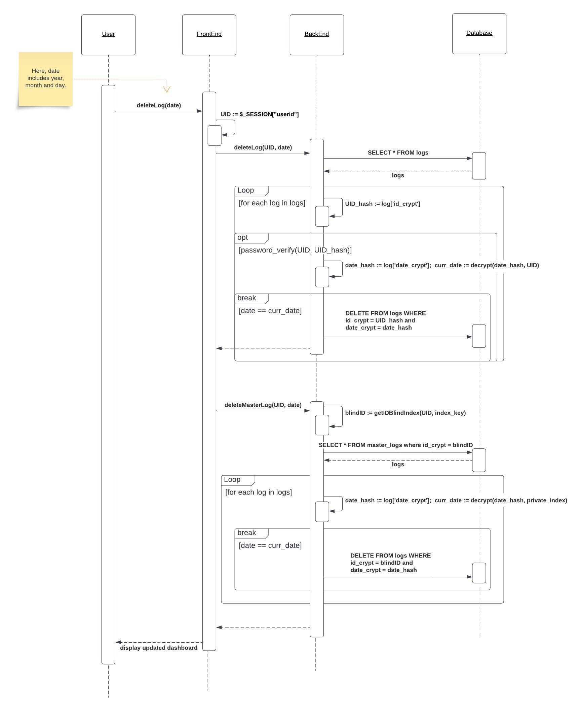
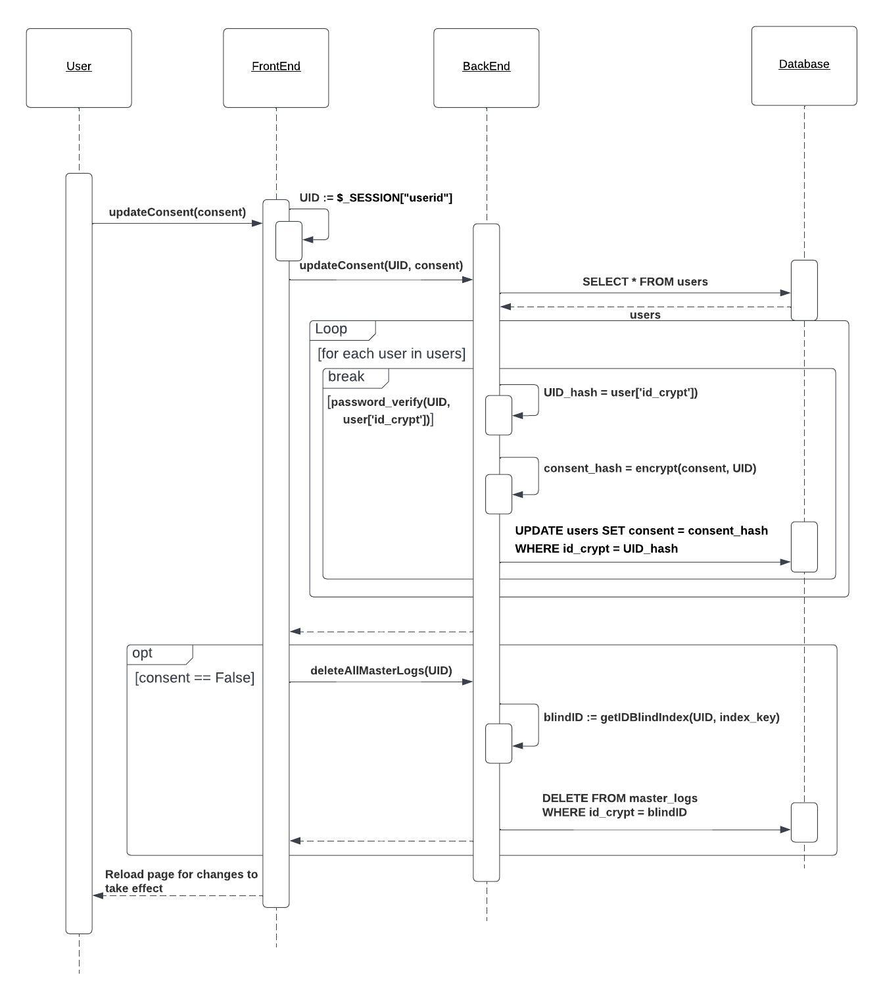
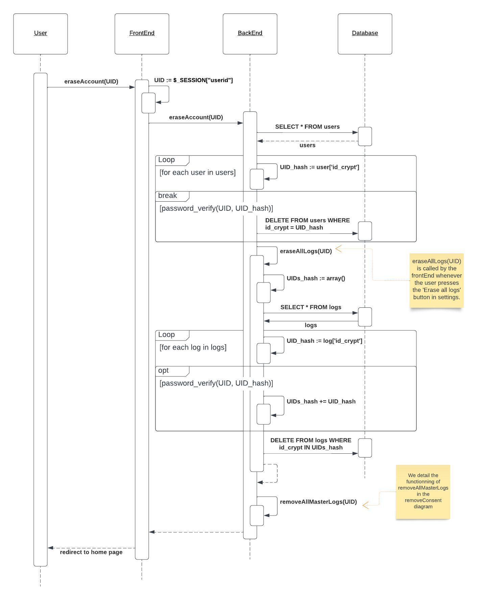

# Architecture

## 1. Stakeholders

The direct stakeholders include:

* Clients
  * These are the players conversing with the interactive frontend of our architecture. Their boundaries start and end in the tangible product shown on display to the world.
* Designing Engineers
  * These are the players who maintain and develop the interactable product the clients engage with. They work with feedback obtained from the client to preserve the quality of the frontend and converse with the backend engineers to coordinate further development limitations and freedom.
* Backend Engineers
  * These are the players who engage in the development, maintenance, and research of the backend database. Both high level technological solution designing and low level implementations, while coordinating with design engineers on practical limitations on the connection of backend and frontend architecture.
* Privacy Directors
  * High level technological solution designing for backend architecture revolving around correct and strong security. Inspection, examination, and auditing the security integrity of the frontend, backend, and the connection and interaction of the two.

## 2. Architectural Design Decisions

Many architectural design decisions were discussed and concluded with the goal of achieving heightened privacy security for the clients. For each design implementation, the privacy advantages were thoroughly assessed with tradeoffs, both of intractability and implementation elegance, in mind and taken into account.

### Single Unique Identifier Account System

Clients are given a unique and randomly generated 16-digit ID on account creation. Clients must use this 16-digit ID to log in and use our system under the corresponding account the client wishes to use. This unique ID is the primary key for user logging in the backend server.

When an account is created, it is assigned a 16-digit decimal number within the range of "1000 0000 0000 0000" to "9999 9999 9999 9999". This range provides a total of 9 × 10 15 possible account numbers, making it highly unlikely for someone to guess a valid account number. Assuming that there are 100,000 active accounts, an average of 45 × 109 attempts would be required to find a working account, which is practically impossible.

The tradeoffs for this design decision include:

* Inconvenience for users to log in using a long number rather than a familiar username / password.
* Skeptical integrity to mathematically inept users.
* Inability of account recovery due to no proof of account ownership without UID.
* Data with inactive / lost ownership will remain forever.

An alternative method was to have a traditional username and password system where the user has autonomy in choosing the two. We rejected this option because of the following tradeoffs we deemed too detrimental to overall privacy.

* Existence of pseudonymized data poses vulnerabilities to identification.
* User account vulnerabilities from external breaches providing username and/or password combination existing on our database (as many people use similar usernames and/or passwords for all their services).

Overall, our decision to apply this architectural design was for the following reasons.

* Minimize any links of user inputted data to corresponding user's identity, either directly or by proxy.
* Circumvent user-created vulnerabilities to their accounts, such as simple passwords or repeated use of breached username and password combination.

### E2EE Based on Unique Identifier

End-to-end encryption (E2EE) is a security protocol designed to protect communications by encrypting messages in a way that only the intended recipients can access the information. This means that the data is encrypted on the sender's device, and can only be decrypted by the intended recipient's device. In an end-to-end encryption system, the encryption keys used to encrypt and decrypt the messages are only known by the sender and the recipient. Our encryption system takes a different route and has it so the encryption key is only held by the user, in the form of their 16-digit identifier. This results in even us, the company and database holder, not having the ability to decrypt our user's information.

The tradeoffs for this architectural design decision affects user convenience.

* No possibility of data retrieval in the case of a user losing their identification code .
* No username to identify users in database means that everything is encrypted using AES, leading to less efficient data pulls.

One alternative to this encryption method is the traditional end-to-end encryption where both the sender (data subject) and receiver (OvaView) both hold the encryption key. This alternative was rejected because of one main disadvantage.

* No fail-safe preventing server from decrypting data subjects' information.
* More vulnerabilities revealed by one more entity holding the encryption key.

Our decision to create a dichotomy where the server is unable to decrypt data creates less flexibility, but increased security. The privacy benefits include the following aspects.

* Peace of mind for user knowing any entity not holding the unique identifier is unable to read data.
* Increased simplicity to secure all possible vulnerabilities.

### Exclusion of Cookies

We exclude the usage of third party cookies in our webapp. This means that our system does not create any cookies on the user's device that communicates with any domain outside of ours. Moreover, we also ensure the lack of cookies mean that even we are not collecting any data on the user while they use our service.

This architectural design policy offers no tradeoffs with respect to user privacy. One could argue this implementation negatively impacts user convenience.

* Users will not have the option of receiving advertisements outside our domain specifically enhanced from the data they submitted to our system.
* Users will be required to log in every time they start a new session.

An alternative decision we could have made would have been to make use of third-party cookies to communicate information with other domains. To put bluntly, we rejected this option swiftly for the following disadvantage.

* As a privacy-minded company, the mere existence of third-party cookies poses a threat to the integrity of our system's fulfillment to prioritize user data protection; one that is not worth risking at the cost of potential quality of life for a portion of our userbase.

This architectural decision provides the following benefits to user privacy protection on our app.

* No disclosure of user data to third parties.
* No tracking of user activity and user data on our service.
* Ensure no tracking from OvaView of the user.
* Clear transparency for the user of the service/consumer dichotomy.

## 3. Architectural Models

The following sequence diagrams capture the key aspects and processes of our system. They illustrate the main data flows between the user, the front-end, the back-end and the database.

A number of key functionalities are not explicitly represented. This is because the key aspects of those functionalities are already shown as part of other sequence diagrams. For example, the functionality of erasing all logs comes down to the front-end calling `deleteAllLogs` to the back-end, as illustrated in the Erase Account diagram. In addition, the process of loading the dashboard is similar to Update Log as the back-end needs to go through the logs table, verify the UID against the hashed UIDs, then return the decrypted values of all matching entries to the front-end. The front-end then displays the populated calender.

To simplify the diagrams, the Add Log, Update Log and Delete Log diagrams use simplified user inputs. Instead of passing a mood, entry and note as input, we pass a unique variable entry. In addition, instead of passing the year,  month and day of the entry as input, we pass a date. 

In Add Log, it is important to note that the front-end does not pass notes to the back-end in addMasterLog. Similarly, in Update Log, the front-end does not pass notes to the back-end in updateMasterLog.

### Sign Up Diagram

### Log In Diagram

### Log Out Diagram

### Add Log Diagram

### Update Log Diagram

### Delete Log Diagram

### Update Consent Diagram

### Erase Account Diagram

## 4. Important Scenarios

### User registration

This scenario occurs when the user interacts with the onboarding page. Upon initiation, the back-end of our app on the local device will do the following:

* Generate a random 16-digit identifier.
* Verify uniqueness of identifier.
  * Retrieve hashed existing UID table from server
  * Compare with hashed table to detect existence of new UID
  * If randomly generated identifier already exists, generate a new one and retry
* Encrypt unique identifier and transfer to server for instantiation in our system.

After the new account is legitimized on our app, the user is displayed their UID to take note of and keep safe. Then, the front-end is redirected to our landing page so the user can log in to their new account (which in parallel, ensures the user took note of their UID).

### User login

Prior to login, users are treated as guests who can only access our informational pages and onboarding page. Successful login occurs when the user enters a valid UID in our system. The backend handles login via verifying through the table of hashed UIDs against the user input. There is no possibility of a non-existing UID to be able to log in to our system.

Successful login will store the inputted UID into the browser session, which will be the key to decrypt user data pulled from the database. Meanwhile, the user will be redirected to their personalized dashboard. The user will now be able to freely access their dashboard and settings options.

No information about user logins is stored in our database.

### Dashboard Data Viewing and Submission/Rectification/Deletion

Upon entering the personal dashboard, users will be able to interact with the calendar user-interface, allowing for 4 different actions per calendar-date.

* Entry viewing
* Entry creation
* Entry modification/rectification
* Entry deletion

Entry viewing is done by simply clicking on dates with an existing entry; all data on the user is retrieved by the front-end from the back-end by filtering through the table of logs using the user's 16-digit identifier they submitted to log in (which is stored in the browser session). All user data retrieved is decrypted using the same 16-digit identifier stored in the session.

Entry submission is initiated by the following protocol:

* Clicking the "add entry" button will create a form object in which the user's selected parameters and input is stored.
* Clicking the "ok" button will
  * encrypt all the data in the form object,
  * create a JSON object holding all the encrypted data,
  * and finally transfer the data to the database.

Entry modification/rectification is achievable only on calendar-dates that hold an existing entry; empty dates will not have this option for users.

* Clicking the "edit entry" button will create a form object pre-loaded with the respective existing data, in which the user can modify the displayed information.
* Clicking the "ok" button will
  * encrypt all the data in the form object,
  * create a JSON object holding all the encrypted data,
  * and pull the calendar-date from this data object.
* Using the calendar-date and UID (submitted by user on login), verifying all hashed UIDs against the user's and comparing decrypted dates with input date will yield the correct entry row. Once found, we will transfer the data to the server using an SQLite update method.

Entry deletion, like modification, is only available when an entry on a date exists.

* Clicking the "delete entry" button will parse the date of the target entry.
* Find entry using the date and UID (submitted by user on login) in database and call an SQL delete command on row.

### Request for Data Deletion

One of the features the user can initiate in the settings tab is data deletion: the user can choose to request

* deletion of all data entries linked to their account
* deletion of account, which will delete all linked data

Request for the deletion of all data entries will, following the its name, delete all logs tied to the UID of the user making this request. This will be done by the following protocol:

* Retrieve table of all entries from the server
* Scan entries by hashing UID stored in session by verifying hashed UIDs against the requesting user's
* Call SQL delete row on every hit

Request for the deletion of user account will first do the same protocol as above for deletion of all entries. Then, it will do the following:

* Retrieve table of all users from the server
* Scan users by hashing UID stored in session by verifying hashed UIDs against the requesting user's
* Call SQL delete row on user

After this is done, the user will be logged out of their (now non-existent account) and be sent to the landing page of our website.

### Opt-in / Opt-out

The other feature available to users in the settings tab is to opt-in or opt-out of our period prediction service. User changes of opt-in status is handled by the following protocol:

* Retrieve current consent status and decrypt.
* Flip status of consent and encrypt parameter.
* Update consent parameter of corresponding user to flipped status using SQL update command.

Opted-in users will receive a new feature on their front-end display, showing next month's period prediction.

On the server, a few more changes occur. Firstly, there is a separate table in our database that is functionally the same as the initial table holding all user entries; this table differs in the following ways:

* Inclusion of blind indexes for more efficient data manipulation.
  * A new secondary key performs deterministic hashing on the UID to create consistent indexes for easier data retrieval.
* Rows omit notes, and now hold only dates, symptoms, and moods from user entries.
* Rows are encrypted with a master key the server holds.
  * This allows us to read the rows of this table for further R&D and processing for the stated reasons the user has consented to.

Opted-in users have all entry actions mirrored to the research table. Data manipulation the user commits (entry addition/deletion/modification) happens to both tables: the secure storage table encrypted using UIDs and the research table encrypted using a master key the company holds. This behavior is not retroactive, meaning that data user has submitted before consenting will not be subject to extra processing. 

Moreover, consented users who rescind consent will automatically have all data that has been previously collected while the user gave consent wiped.

Consented users will also have the option of clearing all data collected for analysis purposes without having to rescind consent.

Opted out users are exempt from this extra data flow.

### User Logout

Logged in users have the option to log out of their account. Clicking the logout button will reset the local session variable, meaning their UID they used to log in is gone from any storage on the local device. Users are redirected back to the landing page of our website, with the access to all logged in features gone due to the lack of UID stored in the session variable.

No information about user logouts is stored in our database.
